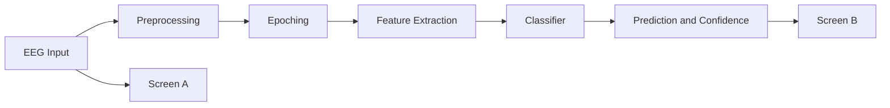

# PPT Content

## Slide 1: Title Slide
- EEG Based Motor Imagery Classification
- Course / Lab / Department details
- Team members and guide
- Date

## Slide 2: Problem Statement
- Objective: decode motor imagery from EEG in near real time
- Practical use case: assistive BCI and hands-free control
- Challenge: low SNR EEG, inter-subject variability, latency constraints

## Slide 3: Project Objectives
- Build Screen A for EEG stream visualization and target selection
- Build Screen B for classifier output, confidence, and trend
- Train model using correct cue labels and strict train/eval split
- Compare baseline results with literature

## Slide 4: Literature Review Method
- Paper selection window: 2023 to 2025
- Sources: IEEE, Springer, Elsevier, ACM
- Group paper target based on team size
- Common review rubric:
  - Dataset
  - Preprocessing
  - Model
  - Metrics
  - Limitations

## Slide 5: Objectives Addressed in Reviewed Papers (Mandatory Table)
| Paper No. | Title | Year | Objectives Addressed |
|---|---|---|---|
| P1 | [Fill] | [Fill] | [Fill] |
| P2 | [Fill] | [Fill] | [Fill] |
| P3 | [Fill] | [Fill] | [Fill] |
| P4 | [Fill] | [Fill] | [Fill] |
| P5 | [Fill] | [Fill] | [Fill] |
| P6 | [Fill] | [Fill] | [Fill] |
| P7 | [Fill] | [Fill] | [Fill] |
| P8 | [Fill] | [Fill] | [Fill] |
| P9 | [Fill] | [Fill] | [Fill] |

## Slide 6: Dataset Summary from Papers (Mandatory Table)
| Paper No. | Dataset Name | Dataset Link | Purpose |
|---|---|---|---|
| P1 | [Fill] | [Fill] | [Fill] |
| P2 | [Fill] | [Fill] | [Fill] |
| P3 | [Fill] | [Fill] | [Fill] |
| P4 | [Fill] | [Fill] | [Fill] |
| P5 | [Fill] | [Fill] | [Fill] |
| P6 | [Fill] | [Fill] | [Fill] |
| P7 | [Fill] | [Fill] | [Fill] |
| P8 | [Fill] | [Fill] | [Fill] |
| P9 | [Fill] | [Fill] | [Fill] |

## Slide 7: Dataset Used in Our Project
- Four-class training files: A01T to A09T
- Evaluation files: A01E to A09E
- Additional two-class files available: B-series (left/right only)
- Data split rule implemented:
  - Training uses only files ending with T
  - Evaluation uses only files ending with E

Dataset links:
- https://www.bbci.de/competition/iv/
- http://bnci-horizon-2020.eu/database/data-sets

## Slide 8: Preprocessing Pipeline
- Channel handling and mapping
- Bandpass filter: 0.5 to 40 Hz
- Notch filter: 50 Hz
- Normalization per channel
- Epoching and feature extraction for classification

## Slide 9: ML/DL Approaches Considered
- Baseline used now: lightweight neural model (MLP-based checkpoint)
- Planned upgrades:
  - EEGNet
  - CNN-LSTM
  - Transformer-lite
- Why upgrades are needed: improve four-class separation and generalization

## Slide 10: Proposed Block Diagram
Use this diagram in draw.io and export PNG for PPT.

## Slide 11: System Architecture
- Frontend:
  - Screen A for EEG and class target control
  - Screen B for live classifier output
- Backend:
  - FastAPI + WebSocket streaming
  - Preprocessing and inference pipeline
  - Retraining script for dataset updates

## Slide 12: Current Baseline Results
- Four-class retraining completed with strict cue filtering
- Trained class coverage: left, right, foot, tongue
- Current hold-out test accuracy: around 26.6%
- Observation:
  - Functional pipeline is complete
  - Model quality needs stronger features/models

## Slide 13: Project Timeline (Date-to-Date)
| Task | Start | End | Duration |
|---|---|---|---|
| SRS and PPT | 10-Apr-2026 | 12-Apr-2026 | 3 days |
| Data preprocessing | 13-Apr-2026 | 15-Apr-2026 | 3 days |
| Baseline implementation | 16-Apr-2026 | 18-Apr-2026 | 3 days |
| Final model tuning | 19-Apr-2026 | 22-Apr-2026 | 4 days |
| Analysis and comparison | 23-Apr-2026 | 25-Apr-2026 | 3 days |

## Slide 14: Tools and Libraries
- Python, FastAPI, Uvicorn
- NumPy, SciPy, MNE, scikit-learn
- HTML, CSS, JavaScript, Canvas
- draw.io for block diagram

## Slide 15: Conclusion and Next Steps
- MVP pipeline complete from stream to prediction
- Retraining logic now follows dataset protocol correctly
- Next work:
  - Better four-class feature engineering
  - EEGNet/CNN-based model upgrade
  - Subject-wise validation and kappa-based reporting

## Slide 16: Q and A
- Thank you
- Contact details
