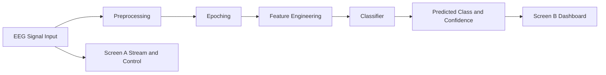

# Project Report

## Title
EEG Based Motor Imagery Classification using Signal Preprocessing and Machine Learning / Deep Learning

## Date
09-Apr-2026

## Team
[Add member names and roles]

## Abstract
This project implements a Brain Computer Interface pipeline for EEG motor imagery classification. The system includes a Python backend and a web frontend with two screens: Screen A for EEG stream visualization and target class control, and Screen B for live prediction and confidence display. The model training pipeline uses GDF files with strict train and evaluation split logic and class-aware selection. Current baseline training uses four cue classes: left, right, foot, and tongue.

## 1. Introduction
Motor imagery classification is a core BCI task where imagined movements are decoded from EEG. This project focuses on building an end-to-end implementation suitable for lab demonstration and iterative research development.

## 2. Literature Review Summary Plan
The final review must include papers from 2023 to 2025 and complete all mandatory tables.

### 2.1 Objectives Mapping Table (Mandatory)
| Paper No. | Title | Year | Objectives Addressed |
|---|---|---|---|
| P1 | [Fill] | [Fill] | [Fill] |
| P2 | [Fill] | [Fill] | [Fill] |
| P3 | [Fill] | [Fill] | [Fill] |
| P4 | [Fill] | [Fill] | [Fill] |
| P5 | [Fill] | [Fill] | [Fill] |
| P6 | [Fill] | [Fill] | [Fill] |
| P7 | [Fill] | [Fill] | [Fill] |
| P8 | [Fill] | [Fill] | [Fill] |
| P9 | [Fill] | [Fill] | [Fill] |

### 2.2 Datasets Used in Reviewed Papers (Mandatory)
| Paper No. | Dataset Name | Dataset Link | Purpose |
|---|---|---|---|
| P1 | [Fill] | [Fill] | [Fill] |
| P2 | [Fill] | [Fill] | [Fill] |
| P3 | [Fill] | [Fill] | [Fill] |
| P4 | [Fill] | [Fill] | [Fill] |
| P5 | [Fill] | [Fill] | [Fill] |
| P6 | [Fill] | [Fill] | [Fill] |
| P7 | [Fill] | [Fill] | [Fill] |
| P8 | [Fill] | [Fill] | [Fill] |
| P9 | [Fill] | [Fill] | [Fill] |

## 3. Objective of Our Project
- Build a real-time MI classification pipeline from EEG.
- Support four MI classes based on cue onset events:
  - 769 left
  - 770 right
  - 771 foot
  - 772 tongue
- Provide a clear frontend for stream interaction and classifier interpretation.

## 4. Experimental Dataset
Dataset files available in project folder:
- Four-class files:
  - Training: A01T to A09T
  - Evaluation: A01E to A09E
- Two-class files:
  - Training: B0101T to B0903T
  - Evaluation: B0104E to B0905E

Dataset links:
- BCI Competition IV: https://www.bbci.de/competition/iv/
- BNCI Horizon: http://bnci-horizon-2020.eu/database/data-sets

Dataset protocol used in project:
- Only T files are used for training.
- E files are reserved for evaluation.
- For strict four-class training, files must contain all four cues.

## 5. Preprocessing Methods
- Channel selection and mapping to analysis layout
- Bandpass filtering: 0.5 to 40 Hz
- Notch filtering: 50 Hz
- Per-channel normalization
- Epoch extraction from cue-related segments
- Feature extraction from mu and beta band behavior

## 6. ML/DL Approaches
Current baseline:
- MLP-based lightweight classifier integrated into checkpoint runtime.

Planned DL upgrades:
- EEGNet baseline for EEG-specific spatial-temporal patterns
- CNN-LSTM for temporal context
- Transformer-lite for sequence modeling

## 7. Proposed Block Diagram

## 8. Implementation Tools and Libraries
- Backend: Python, FastAPI, Uvicorn
- Signal and ML stack: NumPy, SciPy, MNE, scikit-learn
- Frontend: HTML, CSS, JavaScript, Canvas
- Documentation and diagrams: Markdown, draw.io

## 9. Current Implementation Status
Implemented:
- Real-time synthetic EEG stream and controls
- WebSocket pipeline from backend to frontend
- Live prediction with confidence trend
- Retraining script from dataset GDF files
- Class-aware training file filter

## 10. Baseline Training Results (Current)
Latest strict four-class retraining summary:
- Files used: A01T to A09T
- Class counts:
  - left_hand: 648
  - right_hand: 648
  - feet: 648
  - tongue: 648
- Hold-out test accuracy: about 26.6%

Interpretation:
- Pipeline correctness is validated.
- Baseline model quality is limited for four-class MI and needs improved model/feature design.

## 11. Challenges and Observations
- Strong inter-subject variability in EEG patterns.
- Domain mismatch between synthetic stream and real recorded data can affect live behavior.
- Four-class discrimination is harder than two-class left-right setup.

## 12. Improvement Plan
- Add CSP/FBCSP-based features.
- Add EEGNet training and compare with baseline.
- Add kappa score and per-subject evaluation.
- Add robust calibration layer for live inference.

## 13. Project Timeline (Date-to-Date)
| Task | Start Date | End Date | Duration |
|---|---|---|---|
| SRS report and PPT preparation | 10-Apr-2026 | 12-Apr-2026 | 3 days |
| Data preprocessing | 13-Apr-2026 | 15-Apr-2026 | 3 days |
| ML/DL baseline implementation | 16-Apr-2026 | 18-Apr-2026 | 3 days |
| Final model and hyperparameter tuning | 19-Apr-2026 | 22-Apr-2026 | 4 days |
| Result analysis and comparison | 23-Apr-2026 | 25-Apr-2026 | 3 days |

## 14. Conclusion
The project currently provides a complete end-to-end BCI workflow from EEG input simulation to online classification display. Data split and cue-class training rules are correctly enforced. The next stage is to improve model performance for robust four-class motor imagery decoding.

## 15. References (To Finalize)
- Add all selected papers from 2023 to 2025 in IEEE format.
- Add dataset references and tool documentation links.
