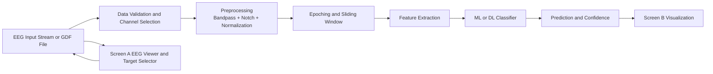

# Software Requirements Specification (SRS)

## Project Title
EEG Based Motor Imagery Classification using Signal Preprocessing and Deep Learning

## Version
- Version: 1.0 Draft
- Date: 09-Apr-2026
- Team: [Add team members]

## 1. Introduction
This SRS defines the functional and technical requirements for a Brain Computer Interface (BCI) project that classifies motor imagery (MI) from EEG signals. The project includes a web frontend and Python backend. Screen A simulates or streams EEG signals and allows target class selection. Screen B displays real-time model predictions and confidence trends.

## 2. Literature Review Plan (Mandatory)

### 2.1 Paper Collection Rule
- Each member must collect 3 papers from 2023/2024/2025 from IEEE, Springer, Elsevier, ACM, or similar sources.
- Expected total papers by team size:
  - Single member: 5 papers
  - Two members: 6 papers
  - Three members: 9 papers
  - Four members: 12 papers

### 2.2 Paper Objective Mapping Table (Mandatory)
| Paper No. | Title | Year | Source | Objectives Addressed |
|---|---|---|---|---|
| P1 | [Fill] | [Fill] | [Fill] | [Fill] |
| P2 | [Fill] | [Fill] | [Fill] | [Fill] |
| P3 | [Fill] | [Fill] | [Fill] | [Fill] |
| P4 | [Fill] | [Fill] | [Fill] | [Fill] |
| P5 | [Fill] | [Fill] | [Fill] | [Fill] |
| P6 | [Fill] | [Fill] | [Fill] | [Fill] |
| P7 | [Fill] | [Fill] | [Fill] | [Fill] |
| P8 | [Fill] | [Fill] | [Fill] | [Fill] |
| P9 | [Fill] | [Fill] | [Fill] | [Fill] |

### 2.3 Dataset Table from Reviewed Papers (Mandatory)
| Paper No. | Dataset Name | Dataset Link | Purpose |
|---|---|---|---|
| P1 | [Fill] | [Fill] | [Fill] |
| P2 | [Fill] | [Fill] | [Fill] |
| P3 | [Fill] | [Fill] | [Fill] |
| P4 | [Fill] | [Fill] | [Fill] |
| P5 | [Fill] | [Fill] | [Fill] |
| P6 | [Fill] | [Fill] | [Fill] |
| P7 | [Fill] | [Fill] | [Fill] |
| P8 | [Fill] | [Fill] | [Fill] |
| P9 | [Fill] | [Fill] | [Fill] |

## 3. Details of Our Project

### 3.1 Objective of Our Project
To design and implement a real-time EEG motor imagery classification system that:
- Accepts EEG streams in Screen A (simulation now, real stream later).
- Predicts motor imagery class in Screen B with confidence over time.
- Supports four cue classes:
  - Class 1: Cue onset left
  - Class 2: Cue onset right
  - Class 3: Cue onset foot
  - Class 4: Cue onset tongue

### 3.2 Experimental Dataset Considered
Primary dataset for four-class training:
- Files used: A01T.gdf to A09T.gdf (training only)
- Files reserved for evaluation: A01E.gdf to A09E.gdf

Additional dataset present in workspace (two-class left/right only):
- B0101T.gdf to B0903T.gdf (training sessions)
- B0104E.gdf to B0905E.gdf (evaluation sessions)

Dataset references:
- BCI Competition IV portal: https://www.bbci.de/competition/iv/
- BNCI Horizon dataset index: http://bnci-horizon-2020.eu/database/data-sets

### 3.3 Preprocessing Methods Considered
- Channel selection and mapping
- Bandpass filtering (0.5 Hz to 40 Hz)
- Notch filtering at 50 Hz
- Per-channel normalization
- Epoch extraction after cue onset (causal windowing for online setup)
- Feature extraction:
  - Mu-band and beta-band power summaries
  - Variability and normalized feature vectors

### 3.4 ML/DL Approach Considered
Planned and current approach:
- Baseline model:
  - Lightweight neural network classifier (MLP-based checkpoint format)
- Next model upgrades:
  - EEGNet
  - CNN-LSTM for temporal dynamics
  - Transformer-lite variant for sequence modeling
- Evaluation metrics:
  - Accuracy
  - Confusion matrix
  - Class-wise precision/recall/F1
  - Kappa score (for competition-style comparison)

### 3.5 Block Diagram of Proposed Approach
Use draw.io or similar tool for final figure. Working diagram below:

### 3.6 Tools and Libraries for Implementation
Development tools:
- Python
- VS Code
- Git and GitHub
- draw.io

Backend libraries:
- FastAPI
- Uvicorn
- NumPy
- SciPy
- MNE
- scikit-learn

Frontend tools:
- HTML
- CSS
- JavaScript
- Canvas API for real-time plotting

### 3.7 Project Timeline (Date-to-Date)
| Task | Start Date | End Date | Duration |
|---|---|---|---|
| SRS report and PPT preparation | 10-Apr-2026 | 12-Apr-2026 | 3 days |
| Data preprocessing implementation | 13-Apr-2026 | 15-Apr-2026 | 3 days |
| ML/DL baseline implementation | 16-Apr-2026 | 18-Apr-2026 | 3 days |
| Final model tuning and hyperparameter search | 19-Apr-2026 | 22-Apr-2026 | 4 days |
| Result analysis and comparison with literature | 23-Apr-2026 | 25-Apr-2026 | 3 days |

## 4. Functional Requirements
- FR1: System shall stream or simulate EEG in real time.
- FR2: System shall allow target MI class selection from frontend.
- FR3: System shall preprocess EEG before inference.
- FR4: System shall produce class prediction and confidence score.
- FR5: System shall display prediction trend on Screen B.
- FR6: System shall support retraining from dataset T files.

## 5. Non-Functional Requirements
- NFR1: Local inference response target below 200 ms per update.
- NFR2: Interface must support at least 10 minutes continuous run without crash.
- NFR3: Project artifacts must be documented for reproducibility.

## 6. Risks and Mitigation
| Risk | Impact | Mitigation |
|---|---|---|
| Domain mismatch between synthetic and real EEG | Wrong live class mapping | Retrain on real dataset and calibrate with validation |
| Class imbalance or partial class coverage | Biased predictions | Enforce class-aware file filtering and class checks |
| Noise and artifacts | Accuracy drop | Use filtering, normalization, artifact-aware trial handling |

## 7. Submission Checklist
- SRS report file
- PPT content file
- Project report file
- Valid dataset links
- Mandatory tables completed
- Final block diagram in draw.io exported to image/PDF
